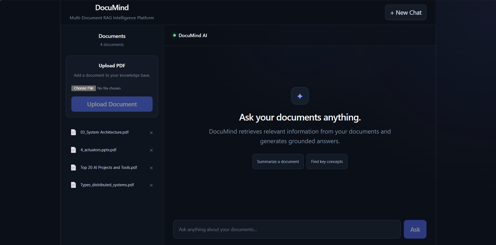

# DocuMind — Multi-Document RAG Intelligence Platform

> An end-to-end Retrieval-Augmented Generation (RAG) platform for intelligent document search, conversational question answering, document summarization, and source-grounded responses.

DocuMind allows users to upload multiple PDF documents and interact with them through a conversational AI interface.

Instead of sending an entire document to an LLM, DocuMind retrieves the most relevant document chunks, reranks them using a cross-encoder, and provides the selected context to an LLM for grounded response generation.

---

## Screenshots

### DocuMind Dashboard



## ✨ Features

- 📄 Multi-document PDF ingestion
- 🔎 Semantic document retrieval
- 🧠 Sentence Transformer embeddings
- ⚡ FAISS vector similarity search
- 🎯 Cross-encoder reranking
- 💬 Conversational RAG with chat history
- 📚 Document-specific querying
- 📝 Automatic document summarization
- 🔗 Source and page-level references
- 🖼️ OCR fallback for scanned/image-based PDF pages
- 💾 Persistent FAISS vector index
- 🔄 Automatic index rebuilding when documents change
- 🌐 FastAPI REST backend
- ⚛️ React + Vite frontend
- 🗂️ Document upload and deletion
- ❤️ Backend health monitoring

---

# 🏗️ Architecture

```text
                         ┌─────────────────────┐
                         │     React + Vite    │
                         │      Frontend       │
                         └──────────┬──────────┘
                                    │
                              REST API / HTTP
                                    │
                                    ▼
                         ┌─────────────────────┐
                         │       FastAPI       │
                         │       Backend       │
                         └──────────┬──────────┘
                                    │
                    ┌───────────────┼────────────────┐
                    │               │                │
                    ▼               ▼                ▼
             PDF Document      RAG Engine       Summarization
                Loader
                    │               │
                    ▼               ▼
              Text Extraction   FAISS Search
                    │               │
                    ▼               ▼
              OCR Fallback     Embeddings
                                    │
                                    ▼
                            Cross-Encoder
                              Reranking
                                    │
                                    ▼
                              OpenRouter
                                 LLM